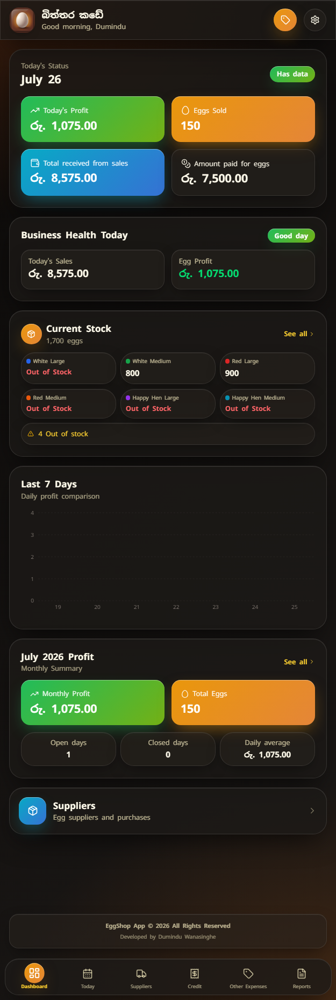
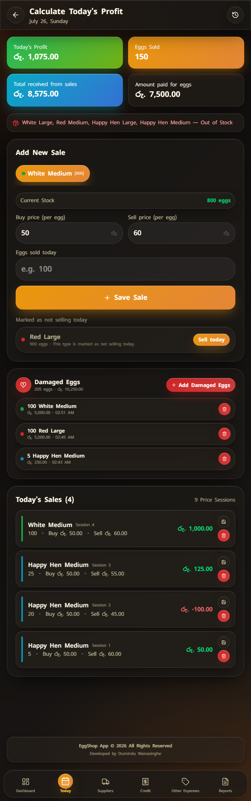
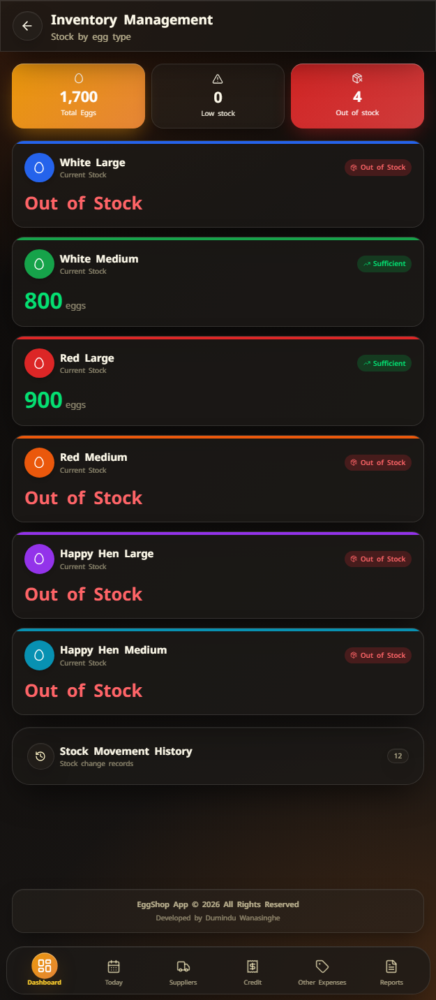
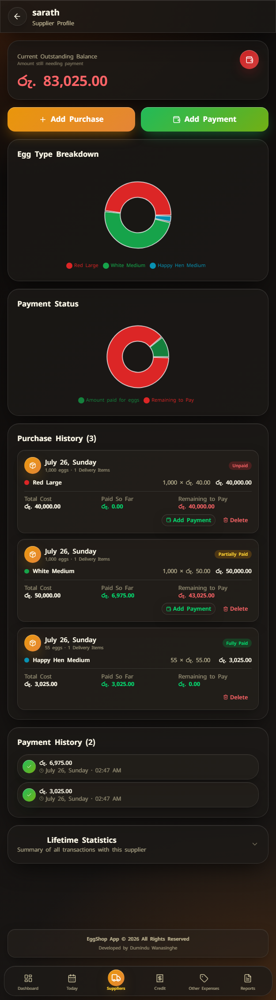
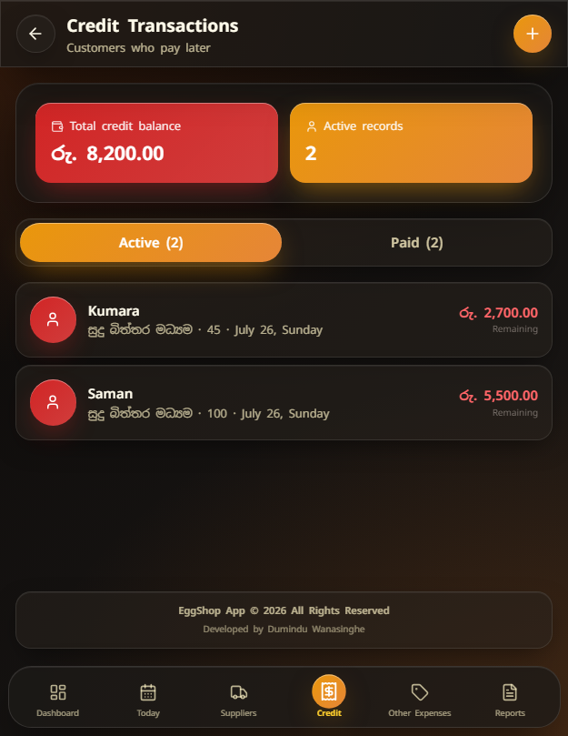
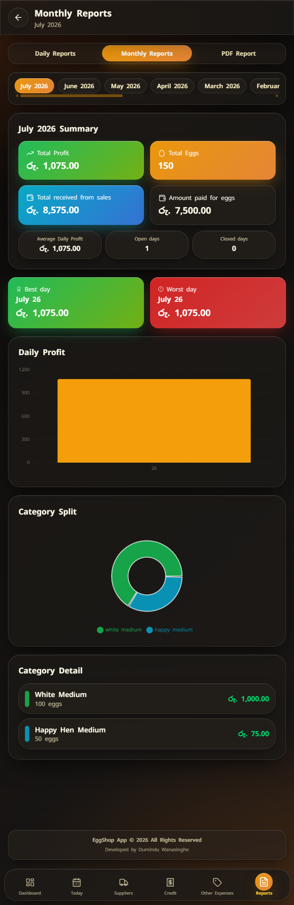
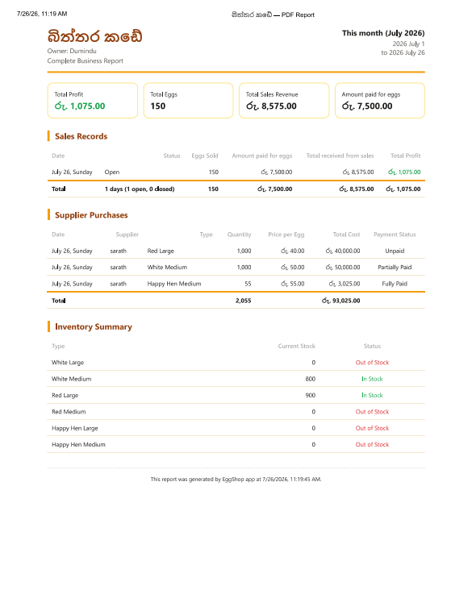
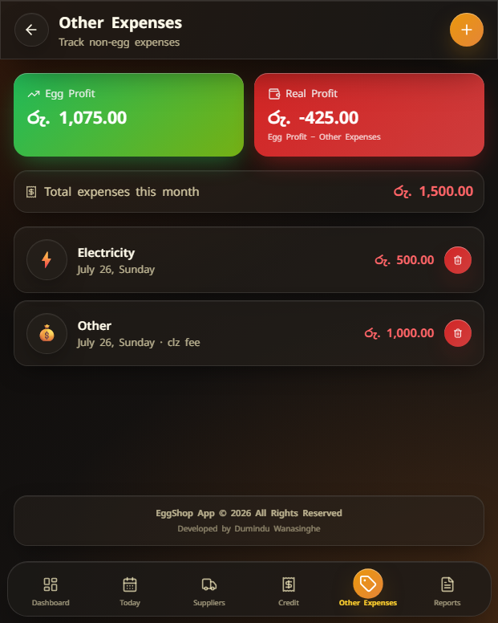
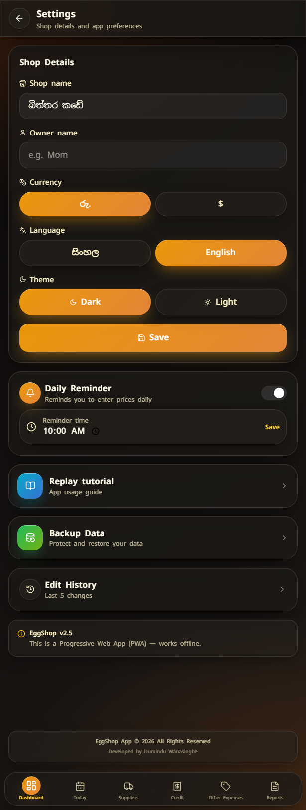
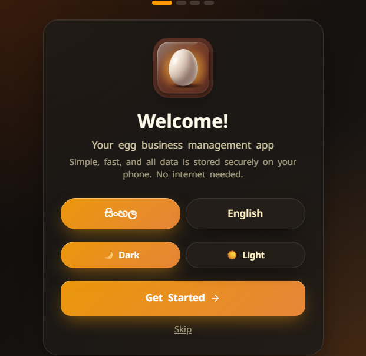

# 🥚 EggShop

<p align="center">
  

# 🥚 EggShop

### Modern Offline-First Egg Shop Management System

A beautiful Progressive Web App designed for egg shop management.

Manage inventory, suppliers, customer credit, expenses, reports, daily sales, and business operations — all in one simple application.

🌐 **Live Demo**  
https://eggshop-management.vercel.app/

</p>

<p align="center">


</p>

---

# ✨ Overview

EggShop is a modern **offline-first Progressive Web App** built to simplify the day-to-day management of a egg shop.

Designed with simplicity in mind, it allows users to manage inventory, suppliers, customer credit, sales, expenses, reports, and profits from one clean interface without requiring an internet connection.

The application focuses on speed, ease of use, and reliability for everyday business operations.

---

# 🚀 Features

| Module | Description |
|---------|-------------|
| 🥚 Daily Sales | Daily price management, multiple price sessions and profit calculation |
| 📦 Inventory | Automatic stock management with live inventory tracking |
| 🚚 Suppliers | Supplier profiles, purchases, payment history and outstanding balances |
| 👥 Customer Credit | Manage customers who pay later with payment history |
| 💰 Profit | Daily, monthly and yearly profit summaries |
| 🧾 Expenses | Record additional shop expenses and calculate real business profit |
| 📊 Reports | Interactive reports with PDF export |
| 🌙 Themes | Beautiful Dark & Light themes |
| 🌐 Languages | Sinhala & English support |
| 📱 PWA | Installable and fully offline |

---

# 🌟 Highlights

- ✅ Offline First
- ✅ Installable PWA
- ✅ Beautiful Modern UI
- ✅ Liquid Glass Design
- ✅ Sinhala & English
- ✅ Local Database
- ✅ Fast Performance
- ✅ Mobile Optimized
- ✅ No Login Required
- ✅ Automatic Calculations
- ✅ Professional Reports

---

# 📱 Main Modules

## 🥚 Daily Business

- Daily egg price management
- Multiple price sessions
- Daily sales calculation
- Automatic profit calculation
- Edit previous records
- Daily history
- Damaged egg tracking

---

## 📦 Inventory

- Live stock management
- Automatic stock increase from supplier purchases
- Automatic stock deduction after sales
- Stock movement history
- Low stock warnings
- Out of stock prevention
- Dashboard stock overview

---

## 🚚 Supplier Management

- Supplier profiles
- Purchase history
- Multiple egg types per purchase
- Partial payment support
- Outstanding balances
- Paid history
- Supplier statistics
- Charts & summaries

---

## 👥 Customer Credit

- Customer list
- Credit management
- Payment history
- Outstanding balances
- Partial payments
- Dashboard reminder cards

---

## 💰 Reports

- Daily reports
- Monthly reports
- Yearly summaries
- Charts & analytics
- PDF export
- Search & filtering

---

## 🧾 Expenses

- Additional business expenses
- Monthly expense tracking
- Expense categories
- Real business profit calculation

---

# 📸 Screenshots

<p align="center">





</p>

<p align="center">
<b>🏠 Dashboard</b>
&nbsp;&nbsp;&nbsp;&nbsp;&nbsp;&nbsp;
<b>🥚 Daily Sales</b>
&nbsp;&nbsp;&nbsp;&nbsp;&nbsp;&nbsp;
<b>📦 Inventory</b>
</p>

<br>

<p align="center">





</p>

<p align="center">
<b>🚚 Suppliers</b>
&nbsp;&nbsp;&nbsp;&nbsp;&nbsp;&nbsp;
<b>👥 Customer Credit</b>
&nbsp;&nbsp;&nbsp;&nbsp;&nbsp;&nbsp;
<b>📊 Reports</b>
</p>

<br>

<p align="center">





</p>

<p align="center">
<b>📄 PDF Reports</b>
&nbsp;&nbsp;&nbsp;&nbsp;&nbsp;&nbsp;
<b>🧾 Expenses</b>
&nbsp;&nbsp;&nbsp;&nbsp;&nbsp;&nbsp;
<b>⚙️ Settings</b>
</p>

<br>

<p align="center">



</p>

<p align="center">
<b>🚀 First-Time Onboarding</b>
</p>

---

# 🛠 Tech Stack

- Next.js 16
- TypeScript
- Tailwind CSS
- Framer Motion
- IndexedDB
- Recharts
- Service Worker
- Progressive Web App (PWA)

---

# 📦 Installation

```bash
git clone https://github.com/dumzvybez/Egg-shop-management-app.git

cd Egg-shop-management-app

npm install

npm run dev
```

Open:

```
http://localhost:3000
```

---

# 📱 Progressive Web App

EggShop can be installed like a native mobile application.

Features include:

- ✅ Works completely offline
- ✅ Installable on Android
- ✅ Fast loading
- ✅ Local data storage
- ✅ Automatic updates
- ✅ Theme persistence
- ✅ Language persistence

---

# 📂 Project Structure

```
Egg-shop-management-app/
│
├── public/
├── screenshots/
├── src/
├── components/
├── hooks/
├── lib/
├── styles/
│
├── README.md
├── package.json
└── tsconfig.json
```

---

# 🌍 Languages

- 🇱🇰 Sinhala
- 🇬🇧 English

---

# ❤️ Built For

EggShop was created to help small family egg shops manage their daily business more easily through a simple, modern, and offline-first application.

The focus is on keeping business management straightforward while providing the tools needed for inventory, supplier management, customer credit, reports, and profit tracking.

---

# 🚀 Roadmap

### ✅ Completed

- Daily Sales
- Inventory Management
- Supplier Management
- Customer Credit
- Reports
- PDF Export
- Expense Tracking
- PWA Support
- Offline Storage
- Theme Support
- Language Support

### 🔜 Planned

- Backup & Restore
- Excel Export
- Advanced Analytics
- Better Notifications
- Performance Improvements
- UI/UX Enhancements

---

# 👨‍💻 Developer

**Dumindu Wanasinghe**

🌐 **Live Demo**  
https://eggshop-management.vercel.app/

🐙 **GitHub Profile**  
https://github.com/dumzvybez

📦 **Project Repository**  
https://github.com/dumzvybez/Egg-shop-management-app

---

# ⭐ Support

If you found this project useful, consider giving it a ⭐ on GitHub.

It helps the project grow and motivates future improvements.

---

<p align="center">

Made with ❤️ using Next.js & TypeScript

**EggShop v2.5**

</p>